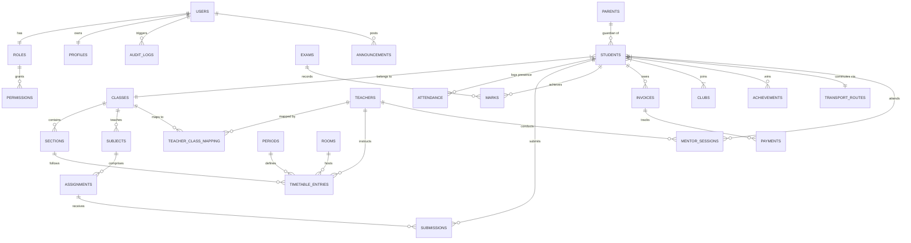

# EduDash ERP — Enterprise Engineering Handbook & Architectural Manual

Welcome to the **EduDash ERP** engineering guide. This is the single source of truth for the architecture, data system, seed pipeline, portal workflows, and backend-readiness strategy of the EduDash School ERP platform. It is designed to onboard developers, database engineers, QA testers, and technical evaluators from zero context.

---

## 🏫 Project Identity

| Property         | Value                                                              |
| :--------------- | :----------------------------------------------------------------- |
| **Name**         | EduDash School ERP Dashboard                                       |
| **Type**         | Frontend-Only SPA (React + Vite) simulating a full K-12 school ERP |
| **School Scale** | Nursery to Class 12 · 4 sections per class · 60 classes total      |
| **Data Scale**   | ~300 students · 80+ teachers · 4 user roles                        |
| **Framework**    | React 18 + Vite + React Router v7                                  |
| **UI Libraries** | TailwindCSS · Lucide React · Framer Motion                         |
| **Data Storage** | Browser `localStorage` (with in-memory cache)                      |
| **Auth**         | Role-based simulation (Student / Teacher / Parent / Admin)         |

---

## 📅 System Execution Status Matrix

| Module                      | Sub-System                                                                                                                           | Status      | Notes                                                    |
| :-------------------------- | :----------------------------------------------------------------------------------------------------------------------------------- | :---------- | :------------------------------------------------------- |
| **Authentication**          | Unified login, RBAC, session persistence                                                                                             | ✅ Complete | 4 roles, credential validation, session in localStorage  |
| **Student Portal**          | Dashboard, timetable, profile, attendance, fees, transport, docs, achievements, mentor, clubs, leave                                 | ✅ Complete | Fully service-driven, no direct DB imports               |
| **Parent Portal**           | Multi-child switcher, fee details, transport monitoring                                                                              | ✅ Complete | `ChildScopeSwitcher` with dynamic child context          |
| **Teacher Portal**          | Dashboard, attendance mgmt, marks/exams, assignments, timetable, student performance, leave, mentor, clubs, announcements, reports   | ✅ Complete | All 12 pages use services; no MockDB imports             |
| **Admin Portal**            | Students, Teachers, Parents, Classes, Subjects, Timetable, Results, Attendance, Fee Management, Transport, Notices, Clubs, Workload Analytics | ✅ Complete | 24 pages; some still use MockDB directly (known debt). (Academic & Attendance analytics removed) |
| **Seed System**             | Institutional data generation for all entities                                                                                       | ✅ Complete | Fully dynamic generators for students, parents, teachers |
| **Academic Structure**      | Periods, rooms, academic calendar                                                                                                    | ✅ Complete | `academicStructure.js` + persisted to localStorage       |
| **Schema Migrations**       | Version-stamped field evolution                                                                                                      | ✅ Complete | `migrationManager.js` runs on every boot                 |
| **Initialization Pipeline** | Storage setup, seeding, migrations, validation                                                                                       | ✅ Complete | Runs synchronously before React mounts                   |
| **Real Backend**            | REST/GraphQL APIs                                                                                                                    | 🔴 Planned  | `getDataProvider()` seam ready for swap                  |
| **Real Database**           | PostgreSQL / MySQL                                                                                                                   | 🔴 Planned  | ERD and schema models defined                            |
| **File Uploads**            | Cloud storage (AWS S3)                                                                                                               | 🔴 Planned  | UI simulates upload progress                             |
| **WebSockets**              | Real-time sync across portals                                                                                                        | 🔴 Planned  | Scheduled for Phase 2                                    |

**Legend**: `✅ Complete` · `🟡 In Progress` · `🔴 Planned`

---

## 🏛️ System Rationale: Why Frontend-First?

EduDash was deliberately built **Frontend-First, Backend-Ready** to solve critical enterprise risks early:

1. **API Contract Preparation** — Abstract async services (`services/`) define complete data contracts (JSON payloads, query parameters, types) before any backend is written. When real APIs arrive, only the data provider implementation changes — zero UI regressions.
2. **Workflow Validation** — Complex multi-portal flows (multi-child switching, assignment pipelines, attendance cascades) were validated in the browser by real users before any database schema was committed.
3. **Layout Stabilization** — ERPs are data-dense and prone to layout shifts (CLS) and route unmount bugs. Building the shell first permanently stabilized nested layout outlets, loading skeletons, and memoization boundaries.

---

## 🗃️ Folder Architecture

```txt
src/
 ├── auth/               # RBAC roles, navigation maps, portal route definitions
 ├── components/         # Shared UI system (MainCard, SkeletonCard, ErrorBoundary, etc.)
 ├── context/            # AuthContext, StudentContext, LanguageContext
 ├── data/               # Data provider abstraction layer (getDataProvider)
 ├── docs/               # Internal architecture references (e.g., user_roles_capabilities_matrix.md map)
 ├── hooks/              # useService (WeakMap caching hook)
 ├── initialization/     # Boot pipeline: storage setup, seeding, migrations, validation
 ├── layouts/            # Role-scoped layout shells (StudentLayout, TeacherLayout, etc.)
 ├── mockDB/             # MockDB facade + query engine + seed generators
 │   ├── core/           # engine.js (where, findOne, findById)
 │   ├── seed/           # All seed data generators and static arrays
 │   └── index.js        # MockDB central facade (find, update, all per entity)
 ├── pages/              # Lazy-loaded portal pages
 │   ├── admin/          # 26 admin pages
 │   ├── teacher/        # 12 teacher pages
 │   ├── student/        # 2 dedicated student pages
 │   └── auth/           # LoginPage
 ├── persistence/        # storage.js, storageKeys.js, seedInitializer.js
 ├── routes/             # ProtectedRoute.jsx (RBAC gate)
 ├── selectors/          # Reusable data selectors
 ├── services/           # 22 async service modules
 ├── translations/       # EN/HI language dictionaries
 └── utils/              # Date helpers, attendance calculators
```

---

## ⚙️ Application Boot Sequence

This is the most critical thing to understand about EduDash. The entire initialization pipeline runs **synchronously before React mounts** in `main.jsx`:

```txt
main.jsx
  └─ initializeERP()
       │
       ├─ 1. initializeStorage.ensureRequiredKeys()
       │      Ensures all localStorage keys exist (writes empty arrays if missing).
       │      Prevents runtime null-access crashes on first load.
       │
       ├─ 2. initializeSeeds.checkAndSeed()
       │      Guard: if students + teachers + authUsers + classes all exist → skip.
       │      Otherwise: runs the full seedData(db) pipeline.
       │      Stamps schema version keys after seeding.
       │
       ├─ 3. migrationManager.runMigrations()
       │      Checks schema version stamps.
       │      If version mismatch → transforms all existing records in-place.
       │      Example: backfills admissionNo, guardianLinkage, emergencyContacts.
       │
       └─ 4. runtimeValidator.validateAll()
              Checks structural integrity of students, teachers, classes,
              subjects, streams, and authUsers.
              Throws if any critical collection is missing or malformed.
              Prevents a broken data state from ever reaching the UI.
```

To **force a full re-seed** (e.g., after updating seed data):

```js
// In browser console:
localStorage.clear();
// Then refresh the page.
```

Or use the programmatic reset:

```js
import { resetERPData } from "./initialization/initializeERP";
resetERPData(); // Clears all data, re-seeds, re-runs full pipeline, fires 'erp-reset-event'
```

---

## 🌱 Seed Data System

All institutional data is generated at first load and persisted to localStorage. There is **one source of truth per entity**:

| Entity                                                     | Source File                 | Method                                                                 |
| :--------------------------------------------------------- | :-------------------------- | :--------------------------------------------------------------------- |
| Students                                                   | `seed/expandedStudents.js`  | `generateExpandedStudents()` — dynamic generator                       |
| Parents                                                    | `seed/expandedStudents.js`  | `generateExpandedParents(students)` — dynamic generator                |
| Teachers                                                   | `seed/relationships.js`     | `baseTeachers` — static array (Nursery–Class 12 specialization)        |
| Classes                                                    | `seed/classes.js`           | `getClassesSeed()` — Nursery to Class 12, 4 sections each              |
| Subjects                                                   | `seed/subjects.js`          | `subjectsSeed` — Foundation → Senior Secondary                         |
| Streams                                                    | `seed/streams.js`           | `streamsSeed` — Science/Commerce/Humanities for Class 11–12            |
| Academic Structure                                         | `seed/academicStructure.js` | `periodsSeed`, `getRoomsSeed()`, `academicCalendarSeed`                |
| Timetable Assignments                                      | `seed/timetable.js`         | `teacherSubjectAssignmentsSeed`                                        |
| Fees, Exams, Transport, Notices, Events, Clubs, Mentorship | `seed/relationships.js`     | Static arrays                                                          |
| Auth Users                                                 | `mockDB/authUsers.js`       | `generateAuthUsers(db)` — generated from students + teachers + parents |
| Daily Attendance, Leave, Mentor Remarks, Class Updates     | `mockDB/*.js`               | Dynamic generators called by `seedData()`                              |

### Student Generator Details

- **Scale**: ~300 students (Nursery–Class 12, 4 sections × min 5 per section; foundation classes get 6)
- **Admission numbers**: `ADM2026XXXX` format
- **IDs**: `stud-001`, `stud-002`, ... sequential
- **Streams**: Class 11–12 sections map to Science Non-Medical (A), Science Medical (B), Commerce (C), Humanities (D)
- **Parent linkage**: Each student gets a `parentIds[]` array; parents are generated 1:1 per student

### Teacher Specialization Rules

- **Nursery to Class 4**: `teacherType: "section-homeroom"` — one teacher per section, teaches all subjects
- **Class 5 to 12**: `teacherType: "subject-specialized"` — one teacher per subject domain
- **Activity teachers**: Art, Music, PE, Library — assigned across all classes

---

## 💾 Data Storage Architecture

All runtime data lives in **browser `localStorage`**, with an **in-memory Map cache** inside `persistence/storage.js` to avoid repeated JSON parsing.

### Centralized Storage Keys (`persistence/storageKeys.js`)

```txt
Authentication:      edudash_auth_state
Core Entities:       erp_students · erp_teachers · erp_parents · erp_authUsers
                     erp_classes · erp_subjects · erp_streams
Academic:            erp_teacherSubjectAssignments · erp_dailyAttendance
                     erp_attendanceSessions · erp_exams · erp_results
                     erp_assignments · erp_submissions
                     erp_periods · erp_rooms · erp_academicCalendar
Finance:             erp_fees · erp_invoices · erp_receipts
Transport:           erp_transportRoutes · erp_transportVehicles
                     erp_transportDrivers · erp_transportAssignments · erp_transportAlerts
Clubs:               erp_clubs · erp_clubEnrollments · erp_clubActivities · erp_clubCoordinators
Mentorship:          erp_mentorAssignments · erp_mentorSessions · erp_mentorRemarks
Other:               erp_documents · erp_achievements · erp_notices · erp_events
                     erp_leaveRequests · erp_classUpdates
Schema Versions:     erp_students_schema_version · erp_remarks_schema_version
```

### `persistence/storage.js` API

```js
getItem(key, defaultValue); // Safe read with JSON.parse + memoryCache
setItem(key, value); // Safe write with JSON.stringify + memoryCache update
removeItem(key); // Safe delete from both stores
clearAllData(); // Clears all ERP keys (preserves auth state)
clearAuth(); // Clears auth state + sessionStorage
setItems({ key: value }); // Batch write
```

### MockDB Facade (`mockDB/index.js`)

`MockDB` is a **facade object** that routes all queries through the persistence layer:

```js
MockDB.students.find(query); // Returns matching records from localStorage
MockDB.students.findById(id); // Single record lookup
MockDB.students.all(); // Returns full collection as Promise
MockDB.students.update(id, data); // Mutates record and writes back to localStorage
// Same pattern for: teachers, parents, classes, subjects, authUsers,
// teacherSubjectAssignments, results, assignments, submissions, fees, etc.
```

Powered by `mockDB/core/engine.js` which implements `where()`, `findOne()`, `findById()` with query predicate matching.

---

## 🔐 Authentication System

- **4 Roles**: `STUDENT`, `TEACHER`, `PARENT`, `ADMIN`
- **Flow**: `AuthContext.login()` → `authService.authenticate()` → `provider.getAuthUserByUsername()` → password check → session object returned
- **Session object** contains: `role`, `linkedEntityId`, `authUserId`, `name`, `admissionNumber`, `avatarInitials`, `avatarColor`, `profile` (full entity)
- **Session persisted** to `edudash_auth_state` in localStorage
- **Each auth user** has a `linkedEntityId` pointing to the real entity (`stud-001`, `teach-001`, `parent-001`)
- **Demo accounts** available via `authService.getDemoAccounts()` — used on the login page for quick access

---

## 🔀 Data Access Architecture (Current vs. Target)

```txt
Current Flow:
  Page/Component
      ↓
  Service (e.g., studentService.getStudentProfile)
      ↓
  Data Provider (getDataProvider → provider.getStudents())
      ↓
  MockDB (MockDB.students.all())
      ↓
  persistence/storage.js → localStorage + memoryCache

Target Flow (Backend-Ready):
  Page/Component
      ↓
  Service (unchanged)
      ↓
  Data Provider (swap to HTTP client — ONLY change needed)
      ↓
  REST / GraphQL API
      ↓
  PostgreSQL / Redis
```

### The Backend-Swap Seam

`src/data/index.js` exports `getDataProvider()` which returns an object with async methods:

```js
provider.getStudents();
provider.getTeachers();
provider.getParents();
provider.getAuthUsers();
provider.getAuthUserByUsername(username, role);
provider.getClasses();
provider.getSubjects();
// ... all entities
```

**To connect a real backend**: replace the provider implementation in `src/data/providers/` with `fetch()` or `axios` calls. Zero changes required in services, pages, or contexts.

---

## 🏢 Portal Overview

### 🧑‍🎓 Student Portal

**Role**: Data consumer and task executor.

Pages: Dashboard · Courses · Faculty · Weekly Timetable · Examination · School Calendar · Fee Details · Documents · Assignments · Achievements · Mentor Support · Clubs & Committees · Transport · Student Profile · Leave

### 🧑‍👩‍👦 Parent Portal

**Role**: Auditor and supervisor.

Uses the same student pages via `ChildScopeSwitcher` (multi-child account support). Dedicated: Fee Details · Transport. Parent context scoped to the authenticated parent's `childIds`.

### 🧑‍🏫 Teacher Portal (12 pages)

**Role**: Primary data writer — attendance, marks, assignments.

Pages: Dashboard · Attendance Management · Assignments Management · Marks & Exams · Class Timetable · Student Performance · Announcements · Mentor Support · Clubs & Activities · Reports & Analytics · Profile Settings · Leave Management

All 12 pages use services exclusively — no MockDB imports, no direct localStorage access.

### ⚙️ Admin Portal (24 pages)

**Role**: System governance — master data, configuration, analytics.

Pages: Dashboard · Students · Teachers · Parents · Admins · Classes · Subjects · Subject Allocation · Timetable · Examinations · Results · Attendance Overview · Leave Approvals · Fee Management · Transport Management · Documents · Notices · Announcements · Clubs · Committees · Achievements · School Calendar · Workload Analytics · Admin Profile

*Note: The "Academic Performance" and "Attendance Insights" analytics dashboards have been removed from the Admin Portal navigation. Refer to the comprehensive [user_roles_capabilities_matrix.md](file:///d:/Projects/school-erp-dashboard/src/docs/user_roles_capabilities_matrix.md) map for functional role capabilities and access permissions across all modules.*

> **Note**: 23+ admin pages still import MockDB directly rather than using services — this is known architectural debt and is on the refactoring roadmap.

---

## 🔄 Cross-Portal Data Flow Examples

### Attendance Log Flow

1. Teacher marks student absent in `AttendanceMgmtPage`
2. `attendanceService` writes record to `erp_dailyAttendance`
3. Student portal reads updated attendance → recalculates percentage
4. If below 75% threshold → "Action Needed" warning card appears on student dashboard
5. Parent portal displays attendance alert for the child

### Assignment Submission Flow

1. Teacher publishes assignment in `AssignmentsManagementPage`
2. `assignmentService` writes to `erp_assignments` + creates pending submission records in `erp_submissions`
3. Student sees assignment in task feed
4. Student submits → status updates to `SUBMITTED` in `erp_submissions`
5. Teacher sees submission for grading in their assignments page

### Timetable Update Flow

1. Admin modifies schedule in `TimetablePage`
2. `timetableService` updates `erp_teacherSubjectAssignments`
3. Teacher portal shows revised lesson blocks
4. Student portal renders updated timetable card
5. Parent portal displays correct daily schedule

---

## 🗃️ Entity Relationship Diagram (ERD)



---

## 🛠️ Database Migration Guidelines

When migrating from localStorage MockDB to a persistent SQL database (PostgreSQL recommended):

### 1. Normalization

- Maintain **Third Normal Form (3NF)** — no calculated fields stored (e.g., `overallAttendance`, `outstandingBalance`)
- Enforce `ON DELETE RESTRICT` on master institutional data to prevent orphaned records

### 2. Indexes

```sql
CREATE INDEX idx_submissions_student_assignment ON submissions(student_id, assignment_id);
CREATE INDEX idx_attendance_student_date ON attendance(student_id, date);
CREATE INDEX idx_students_class ON students(class_id);
```

### 3. Junction Tables

```sql
CREATE TABLE student_club_memberships (
    student_id VARCHAR(50) REFERENCES students(id) ON DELETE CASCADE,
    club_id    VARCHAR(50) REFERENCES clubs(id) ON DELETE CASCADE,
    joined_at  TIMESTAMP DEFAULT CURRENT_TIMESTAMP,
    PRIMARY KEY (student_id, club_id)
);
```

### 4. Status Enums

```sql
CREATE TYPE assignment_status AS ENUM ('PENDING', 'DUE_SOON', 'OVERDUE', 'SUBMITTED', 'REVIEWED');
CREATE TYPE leave_status AS ENUM ('PENDING', 'APPROVED', 'REJECTED');
CREATE TYPE teacher_type AS ENUM ('section-homeroom', 'subject-specialized', 'activity-specialized');
```

### 5. Soft Deletion

- Always use `deleted_at TIMESTAMP NULL` instead of hard deletes on institutional entities

---

## ⚖️ Key Architectural Decisions

### 1. Service Abstraction Rule

**Decision**: All pages interact exclusively with async services — never directly with MockDB or localStorage.  
**Rationale**: Decouples UI from storage. Backend swap is localized to `src/data/providers/`.

### 2. WeakMap Caching in `useService.js`

**Decision**: Custom hook uses `WeakMap` instead of plain object for service result caching.  
**Rationale**: Production minifiers (Vite/esbuild) collapse function names to single characters — a plain object cache would cause keys to collide and overwrite each other.

### 3. Single Source of Truth per Entity

**Decision**: Each entity type has exactly one generator/array as its source. No duplicate definitions.  
**Rationale**: Prevents ID conflicts, broken parent mappings, and inconsistent data across portals.

### 4. Blocking Initialization Before Mount

**Decision**: `initializeERP()` runs synchronously before `ReactDOM.createRoot().render()`.  
**Rationale**: Guarantees that all data exists in localStorage before any component's `useEffect` or service call fires. Eliminates race conditions on first load.

### 5. Schema Version Stamps

**Decision**: After seeding, write version stamps (e.g., `erp_students_schema_version: "v5"`). On boot, if version mismatches, transform data in-place.  
**Rationale**: Allows safe field additions/renames across app versions without requiring users to clear their data.

### 6. Context-Scoped State Only

**Decision**: Global state is limited to focused contexts (`AuthContext`, `StudentContext`, `LanguageContext`). No Redux or large state stores.  
**Rationale**: Reduces re-render surface area and keeps portal boundaries clean.

---

## ⚠️ Current Limitations

1. **localStorage Scope**: All data is browser-local. Different browsers/devices do not share data.
2. **Mock Authentication**: Passwords are stored and compared in plaintext in `erp_authUsers` — no hashing.
3. **No Real-Time Sync**: Changes in one browser tab do not propagate to others without a page refresh.
4. **Simulated File Uploads**: File attachment UIs simulate progress locally; no actual file is stored.
5. **Admin MockDB Debt**: 23+ admin pages import `MockDB` directly instead of going through services — flagged for refactoring.
6. **No Concurrency Control**: Simultaneous updates to the same record from different portals don't trigger version checks.

---

## 🤝 Contribution Guidelines

1. **Service-Only Data Access**: Pages must never import `MockDB` or `localStorage` directly. Use services.
2. **No Business Logic in Components**: Calculations, filters, and data joins belong in services or selectors.
3. **Immutable State Treatment**: Never mutate service-returned arrays in-place. Use `setState` or derived state.
4. **Memoization**: Wrap expensive calculations in `useMemo`; wrap stable pure components in `React.memo`.
5. **Lazy Loading**: All portal pages must be imported with `React.lazy()` + `Suspense`.
6. **Style Consistency**: Follow HSL color scheme, `rounded-3xl` / `rounded-[2rem]` borders, consistent spacing.
7. **Conventional Commits**: Use `feat(scope)`, `refactor(scope)`, `perf(scope)`, `fix(scope)`.
8. **Single Source of Truth**: Never define a new static array for entities that already have a generator. Extend the generator instead.

---

## 🛠️ Local Development & Setup

```bash
# Clone and enter the directory
cd school-erp-dashboard

# Install dependencies
npm install

# Start local dev server
npm run dev

# Production build
npm run build

# Run tests
npm run test
```

### Resetting Seed Data (Development)

When seed data changes, old localStorage data blocks the new seed from running. Clear it:

```js
// Browser console
localStorage.clear();
// Then refresh — new seed runs automatically
```

Once built, `/dist` is fully optimized and ready for deployment to Vercel, Netlify, or AWS S3.
